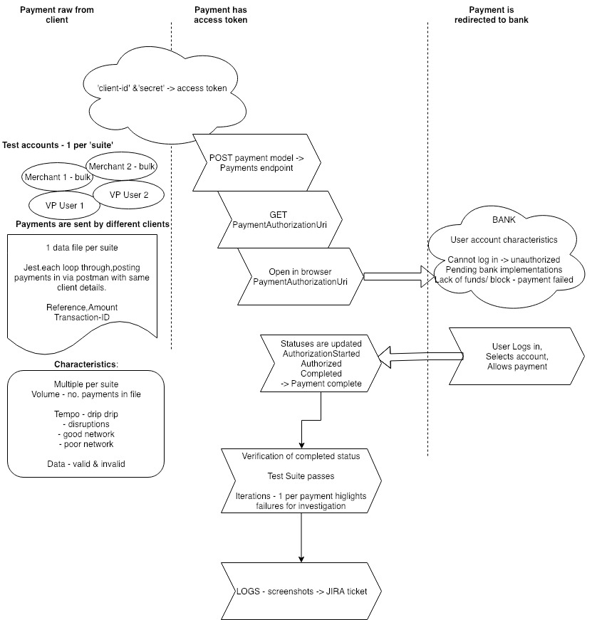

E2E flow: 

# Dependencies
See https://medium.com/@assertis/creating-a-scraper-using-headless-chrome-ecbe4ade9f86 for installation 
* Jest test runner 
* Chromium Puppeteer headless environment
* Typescript - @types/puppeteer, @types/jest ts-jest, @types/expect-puppeteer and associated npm packages
* Node version >= 8.7.0
* npm >= 5.6.0

* Installation

When you have upgraded node and npm to meet above requirements run npm install to get packages listed in the package.json

npm install -g jest may be required to use jest from the command line

* Writing tests
Tests are stored in /__tests__ 
Browser events are coded via the Puppeteer API
Asserts are via expect giving access to Jest matchers

* Running tests
npm t or jest will run all tests in the __tests__ directory jest string will run all tests with names matching the regex /string/ (e.g. stringtest.js or teststring.js) jest string.js will run only string.js

Standard output of test run is to console window. The full test-report.html is in the root directory.

* Debugging
To view the tests in progress uncomment settings in ./jest_config/setup.js
headless: false,
slowMo: 1000,